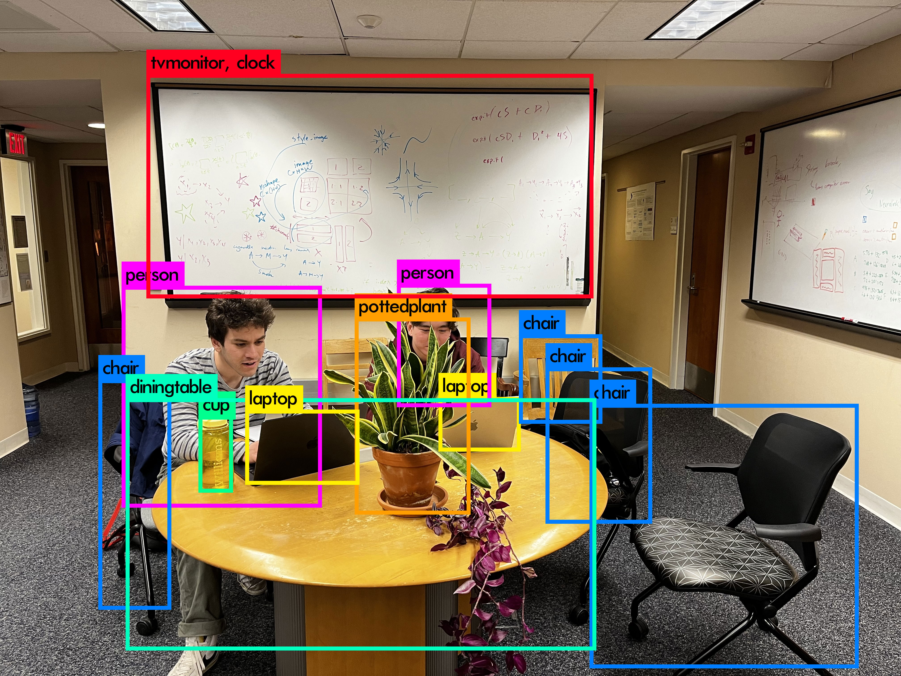

# Yolo-Basic

These are the files for our (Matt Laws and Sam Magid's) final project for CSCI 381, implementing a simplified version of YOLO v1. In this repository, you will find several implementation files, as well as a Jupyter notebook `yolo.ipynb` which explains how YOLO v1 works and steps through our simplified implementation.

You can find our final presentation slides [here](https://docs.google.com/presentation/d/1kxQA2iAef09XOjDW27QjWExxkA6l2RaWHHCA4_tqeaU).
 
